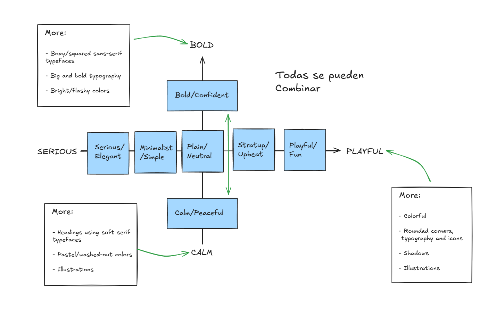

Todas estas practicas vienen de modelos de mas de 100 designs
Distilled into 7 website personalities `Rules should be applied according to selected website personality`

La `website personality` es básicamente un sentimiento o una vibe, que queremos que nuestro sitio le transmita a nuestros usuarios,
una vez sabido eso, choose one of the website personalities accordingly, or multiple personalities

Cuando estemos escogiendo la personalidad de nuestro diseño: How do you want website to appear to users? What "vibe" do you want to transmit

Apply personality traits to each design ingredient = Typography, colors, images, icons, shadows, border-radius, layout

### `Serious/Elegant`: Real estate,high fashion, jewelry, luxury products or services

  - Para mostrar luxury and elegance, based on thin serif typefaces, golden or pastel colors, ang big high-quality images
    No usa shadows ni border radius

  > Ingredients:

  - Typography - Serif typefaces(especially in headings), light - font weight, small body font size
  - Colors - Gold, pastel colors, black, dark blue or grey
  - Images - Big, high-quality images are used to feature - elegant and expensive products
  - Icons - Usually no icons, but thin icons and lines may be - used
  - Shadows - Usually no shadows ❌
  - Border-radius - Usually no border-radius ❌
  - Layout - A creative and experimental layout is quite common

### `Minimalist/Simple`: Fashion, portfolios, minimalism companies, software startups

  - Focusses on the essential text content, using small or medium-sized sans-serif black text, lines, and few-images and small icons

  > Ingredients:

  - Typography - Boxy/squared sans-serif typefaces, small body font sizes - Si se usara un accent podría ser un font diferente(serif)
  - Colors - Usually black or dark grey, on pure white background. Usually just one color throughout the design
  - Images - Few images, which can be used to add some color to the design. Usually no illustrations(especially not 3d), but if, than just black
  - Icons - Usually no icons, but small simple black icons may be used
  - Shadows - Usually no shadows ❌
  - Border-radius - Usually no border-radius ❌
  - Layout - Simple layout, a narrow one-column layout is quite common

### `Plain/Neutral`: Well-established corporations, companies that don't want to make an impact through design

  - Design that gets out of the way by using neutral ans small typefaces, and very structured layout. Common in big corporations

  > Ingredients:

  - Typography - Boxy/squared sans-serif typefaces, small body font sizes - Si se usara un accent podría ser un font diferente(serif)
  - Colors - Neutral-looking sans-serif typefaces are used, and text is usually small and doesn't have visual impact
  - Images - Images are frequently used, but usually in a small format, tal vez solo en el header una big image
  - Icons - Usually no icons, but small simple black icons may be used
  - Shadows - Usually no shadows ❌
  - Border-radius - Usually no border-radius ❌
  - Layout - Structured and condensed layout, with lots of boxes and rows

### `Bold/Confident`: Digital agencies, software startups, travel, "strong" companies

  - Makes and impact, by featuring big and bold typography, paired with confident use of big colored blocks

  > Ingredients:

  - Typography - Boxy/squared sans-serif typefaces, big and bold typography, especially headings. Uppercase headings are common
  - Colors - Usually multiple bright colors. Big color blocks/sections are used to draw attention
  - Images - Lots of big images are usually displayed
  - Icons - Usually no icons ❌ (todos los X pueden ser usados pero solo escasamente)
  - Shadows - Usually no shadows ❌
  - Border-radius - Usually no border-radius ❌
  - Layout - All kinds of layouts, no particular tendencies

### `Calm/Peaceful`: Healthcare, all products with focus on consumer well-being

  - For products and services that care, transmitted by calming pastel colors, soft serif headings, and matching images/illustrations

  > Ingredients:

  - Typography - Soft serif typefaces frequently used for headings, but sans-serif headings might be used too(ex, for software products)
  - Colors - Pastel/washed-out colors: light oranges, yellows, browns, greens, blues
  - Images - Images and illustrations are usual(lot ot people in there), matching with calm color palette in their photos
  - Icons - Icons are quite frequent
  - Shadows - Usually no shadows, but might be used sparingly(escasamente)
  - Border-radius - ✅ Some border-radius is usual
  - Layout - All kinds of layouts, no particular tendencies

### `Startup/Upbeat`: Software startups, and other modern-looking companies

  - Widely used in startups, featuring medium-sized sans-serif typeface,s light-grey text and backgrounds, and rounded elements

  Usa shadows y border radius

  > Ingredients:

  - Typography - Medium-sized headings(not too large), usually one sans-serif typeface in whole design. Tendency for lighter text colors
  - Colors - Blues, greens and purples are widely used. Lots of light backgrounds(mainly gray), gradients are also common
  - Images - Images or illustrations are always used. 3D illustrations are modern. Sometimes patterns and shapes add visual details
  - Icons - ✅ Icons are very frequent
  - Shadows - ✅ Subtle shadows are frequent. Glows are becoming modern
  - Border-radius - ✅ Some border-radius is very common
  - Layout - Rows of cards, rows of product features and Z-patterns are usual, as well as animations

### `Playful/Fun`: Colorful Child products, animal products, food

  - Colorful and round designs, fueled by creative elements like hand-drawn icons or illustrations, animations and fun language

  > Ingredients:

  - Typography - Round and creative(ex handwritten) sans-serif typefaces are frequent. Centered text is more common
  - Colors - Multiple colors are frequently used to design a colorful layout, all over backgrounds and text
  - Images - Images, hand-drawn (or 3D) illustrations, and geometric shapes and patterns are all very frequently used
  - Icons - ✅ Icons are very frequent, many times in a hand-drawn style
  - Shadows - ✅ Subtle shadows are quite common, but not always used
  - Border-radius - ✅ Border-radius is very common
  - Layout - All kinds of layouts, no particular tendencies

Se pueden hacer combinaciones de todos, implementando ciertas características de uno
Usualmente cuando se inyecta bold o calm, es en los headers typefaces, en los titles de las sections, o illustrations in calming pastel colors
